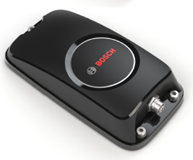

# Bosch AMRA

The AMRA (Asset Monitoring For Railway Applications) is a device that allows to monitor cargo and doors, perform geolocalization and geofencing, and enable shock detection and train diagnostics.

	
## Available devices

We have several AMRA kits available that publish telemetry and events into Hono using a device ID  `amra.<imei>`.

Each AMRA kit regularly transmits sensor data such as acceleration, GPS position, and temperature as telemetry, and also publishes events once a shock is detected.

## Additional information

Detailed technical specifications can be found on the [product page](http://www.bosch-engineering.de/en/de/einsatzgebiete/schienenfahrzeuge/amra/amra_2.html).