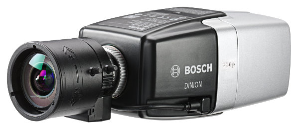

 
# Bosch DINION IP starlight 6000 HD

The Bosch DINION IP starlight 6000 HD is a excellent low-light performance surveillance camera that can be used to detect autonomous scenarios. In addition, with the Microsoft cloud you can analyse emotion in faces.



## Available devices

The DINION cameras are identified through their IP address, printed on the of the device. The following devices are available:

| URL                    | Serial number      | MAC               |
|------------------------|--------------------|-------------------|
| http://192.168.200.200 | 044448771706143013 | 00-07-5F-99-19-C3 |
| http://192.168.200.201 | 044448771705143069 | 00-07-5F-99-19-43 |
| http://192.168.200.202 | 044448771706143015 | 00-07-5F-99-19-D3 |
| http://192.168.200.203 | 044448771705143070 | 00-07-5F-99-19-42 |
| http://192.168.200.204 | 044448771706143019 | 00-07-5F-99-19-D7 |
| http://192.168.200.205 | 044448771705143100 | 00-07-5F-99-19-5E |
| http://192.168.200.206 | 044448771705143101 | 00-07-5F-99-19-5F |
| http://192.168.200.207 | 044448771705143104 | 00-07-5F-99-19-60 |
| http://192.168.200.208 | 044448771706143016 | 00-07-5F-99-19-CA |
| http://192.168.200.209 | 044448771705143071 | 00-07-5F-99-19-44 |
| http://192.168.200.210 | 044448771705143072 | 00-07-5F-99-19-46 |
| http://192.168.200.211 | 044448771705143068 | 00-07-5F-99-19-3E |
| http://192.168.200.212 | 044448771706143018 | 00-07-5F-99-19-D6 |
| http://192.168.200.213 | 044448771705143105 | 00-07-5F-99-19-62 |
| http://192.168.200.214 | 044448771705143102 | 00-07-5F-99-19-2A |
| http://192.168.200.215 | 044448771706143020 | 00-07-5F-99-19-CF |
| http://192.168.200.216 | 044448771705143106 | 00-07-5F-99-19-61 |

## Device capabilities

On top of recording video, the cameras can also
- analyse ambient audio
- receive external alarm signals
- detect shaking of the camera

These signals are then processed and can be used to generate _events_. By default, cameras detect objects
entering the frame and sent out an event `object_seen`. Additional events (including video analytics (IVA))
can be configured directly inside the camera.

### Example telemetry data

```JSON
{
	"topic": "bcx/dinion.044448965910133002/things/twin/commands/modify",
	"path": "/features",
	"value": {
		"event": {
			"properties": {
				"type": "object-seen"
			}
		},
		"storage": {
			"properties": {
				"url": "ftp://bcx-workhorse.bosch-iot-suite.com/dinion.044448965910133002/"
			}
		}
	}
}
```

## Ideas for using this device

- Take a picture with camera when a face is detected and send this picture for analysis into the cloud
- Alarm when the noise level is too high

## Additional information

Detailed technical specifications can be found on the [product page](https://us.boschsecurity.com/en/products/videosystems/ipcameras/hdmpfixedcameras/dinionipstarlight6000hd_1/dinionipstarlight6000hd_1_products_42121).
More infos for recognize emotions in images with Microsoft Cognitive Services [API page](https://www.microsoft.com/cognitive-services/en-us/emotion-api).
