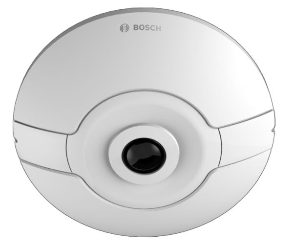

# Bosch FLEXIDOME IP panoramic 7000 MP

The Bosch FLEXIDOME IP panoramic 7000 MP is a nice fisheye surveillance camera that can be used to detect autonomous scenarios. This camera has a 360° view which allows the viewer the full overview in each angle of the office room and this in Full HD quality (1080p).

## Available devices

The FLEXIDOME IP panoramic cameras are identified through their IP address, printed on the of the device. The following devices are available:

| URL                    | Serial number      | MAC               |
|------------------------|--------------------|-------------------|
| http://192.168.200.220 | 044739371723244074 | 00-07-5F-99-49-2A |
| http://192.168.200.221 | 044739371723244053 | 00-07-5F-99-49-16 |
| http://192.168.200.222 | 044739371723244078 | 00-07-5F-99-49-2E |

## Device capabilities

On top of recording video, the cameras can also
- analyse ambient audio
- receive external alarm signals
- detect shaking of the camera

These signals are then processed and can be used to generate _events_. By default, cameras detect objects
entering the frame and sent out an event `object_seen`. Additional events (including video analytics (IVA))
can be configured directly inside the camera.

### Example telemetry data

## Ideas for using this device

- Take a picture with camera when a face is detected and send this picture for analysis into the cloud
- Alarm when the noise level is too high

## Additional information

Detailed technical specifications can be found on the [product page](https://us.boschsecurity.com/en/products/videosystems/ipcameras/panoramiccameras_1/flexidomeippanoramic7000m/flexidomeippanoramic7000m_18936).
