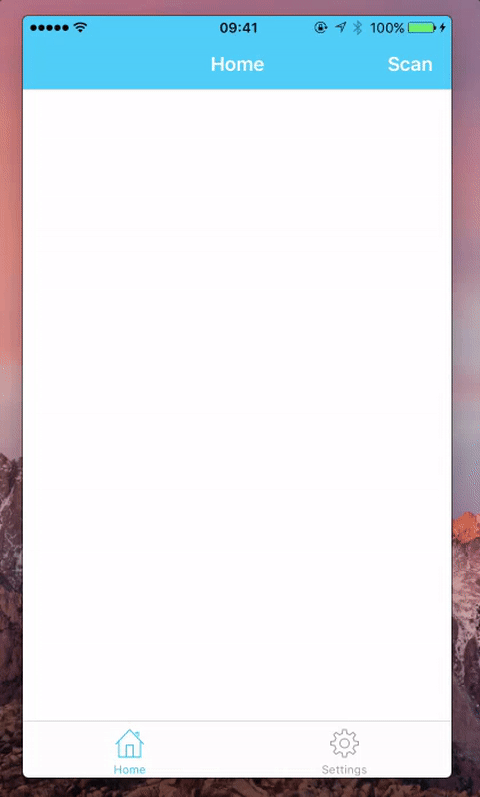
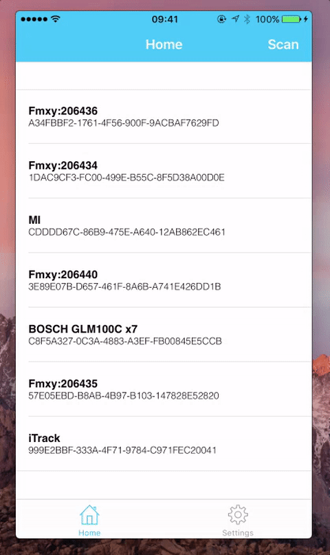
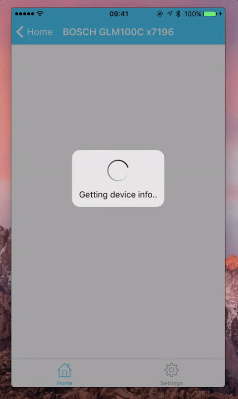
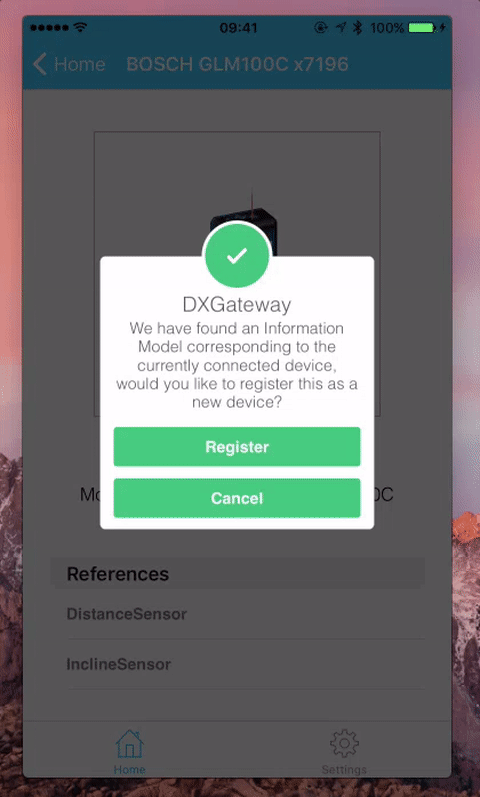

# Bosch GLM 100C 

The Bosch GLM 100 C laser measure combines the precision of laser measures with the convenience of Bluetooth® wireless technology. This innovative product allows users to make accurate measurements that are instantly transferred to smart devices via the free Bosch Measuring Master mobile app. Featuring an extended measuring distance, best-in-class memory storage and angle measurement in two axis.

Create digital floor plans, import and edit existing floor plans, and export the work result with the Measuring Master app.

Ten measurement modes - length, area, volume, angle, min/max, continuous, single indirect height, single indirect length, combined indirect height, and multi-surface are measurement for maximum versatility.

* Measuring distance of up to 100m
* High accuracy with ± 1.5mm
* Large, automatically illuminated flip display.
* Increased memory storage – up to 50 measurements + 1 constant value
* Dust and splash protection: IP 54

## Available devices

## Device capabilities

* [GLM 100C Thing Type description](http://thingtype.bosch-iot-suite.com/#/details/com.bosch.glm/BoschGLM100C/1.0.0)

### Example telemetry data

The captured data will be translated in to following format and send it to Hono:

**Incline Sensor**

	{
	  "topic": "namespace/device_id/things/twin/commands/modify",
	  "path": "/features/inclinesensor/properties/status",
	  "value": {
	    "sensor_units": "degree",
	    "degree": 0.0
	  }
	}

**Distance Sensor**

	{
	  "topic": "namespace/device_id/things/twin/commands/modify",
	  "path": "/features/distancesensor/properties/status",
	  "value": {
	    "sensor_units": "meter",
	    "distance": 0
	  }
	}

For more on the device property structure please refer to the [GLM 100C Thing Type description](http://thingtype.bosch-iot-suite.com/#/details/com.bosch.glm/BoschGLM100C/1.0.0)

## Getting started 

For the BCX hackathon, you have the possibility to use an iOS Mobile Gateway App that connects the GLM 100C via BlueTooth and sends its data to the Suite via HTTP. Just approach the Coaches to request for a mobile with a pre-installed app.

Let's walk you through how to use the app:

### Step 1 : Login

When you open the app, you must log in to the Suite with the BCX user credentials.

### Step 2 : Edit settings

In this step check the settings and change according to the user specific solution. You could change this settings at any point in time too. 

For more customization go to iPhone's Settings and tap  Settings -> DXGatway

### Step 3 : Scan for devices

In this step you can start scanning for the devices, make sure you enable the bluetooth of the iPhone before you hitting the scan button on the top right

### Step 4 : Connect the device

Now we can see the devices nearby and at the moment it only supports Bosch GLM 50C and GLM 100C, so just select that from the list to get it connected with the phone.

### Step 5 : Fetching the device profile information

Upon connecting of the device, the GLM device description is looked via the [Thing Type Repository](http://thingtype.bosch-iot-suite.com/#/details/com.bosch.glm/BoschGLM100C/1.0.0). The Thing Type Repository is completely based on the [Eclipse Open Source Vorto Project](http://www.eclipse.org/vorto) 

### Step 6 : Register device 

The app checks if the device is already registered in the Bosch IoT Suite automatically. If not, it will prompt you to confirm the device registration in the Bosch IoT Suite.

### Step 7 : Start sending data

After the successful registration the user can see the thing id in blue color text and can start capturing data from the connected device. This data will be captured and send to Hono and Things. 

**That's it**. Feel free to verify the incoming data via [Developer Console](https://console.bosch-iot-suite.com)

## Additional information

Detailed technical specifications can be found on the [product page](https://www.bosch-professional.com/de/de/glm-100-c-34166-ocs-p/).
