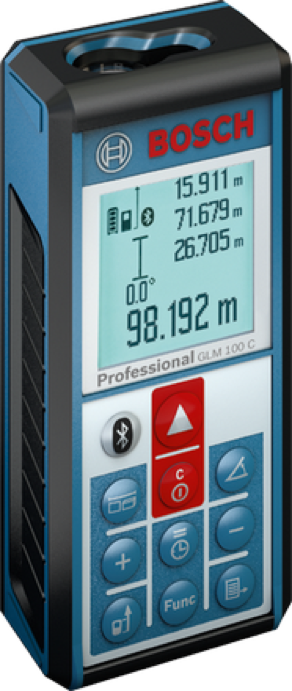

# Bosch GLM 100C 

The Bosch GLM 100 C laser measure combines the precision of laser measures with the convenience of Bluetooth® wireless technology. This innovative product allows users to make accurate measurements that are instantly transferred to smart devices via the free Bosch Measuring Master mobile app. Featuring an extended measuring distance, best-in-class memory storage and angle measurement in two axis.

Create digital floor plans, import and edit existing floor plans, and export the work result with the Measuring Master app.

Ten measurement modes - length, area, volume, angle, min/max, continuous, single indirect height, single indirect length, combined indirect height, and multi-surface are measurement for maximum versatility.

* Measuring distance of up to 100m
* High accuracy with ± 1.5mm
* Large, automatically illuminated flip display.
* Increased memory storage – up to 50 measurements + 1 constant value
* Dust and splash protection: IP 54

## Available devices

## Device capabilities

### Example telemetry data

## Ideas for using this device

## Additional information

Detailed technical specifications can be found on the [product page](https://www.bosch-professional.com/de/de/glm-100-c-34166-ocs-p/).
