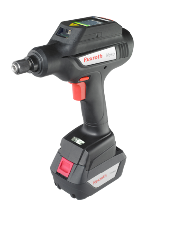

# Bosch Rexroth Nexo 

On Nexo the complete control unit is in the nutrunner – the first of its kind. High-quality measuring electronics for torque and angle of rotation have been integrated directly into the device and can be incorporated without additional hardware into your network. And all of this without cords – easy and cost efficient.


## Available devices

All devices are identified through the information, which can be found on the integrated display. 
The following devices are available:

|         Name            |          MAC        |   IP   |
|-------------------------|---------------------|--------|
|  will be updated on thursday  |  ...  |  DHCP  |
|  ...  	  |  ...  |  DHCP  |
|  ...        |  ...  |  DHCP  |
|  ...        |  ...  |  DHCP  |
|  ...        |  ...  |  DHCP  |
|  ...        |  ...  |  DHCP  |
|  ...        |  ...  |  DHCP  |
|  ...        |  ...  |  DHCP  |
|  ...        |  ...  |  DHCP  |
|  ...        |  ...  |  DHCP  |

You will find the IP adress over the display menu. 


## Device capabilities

On top of tightening, the Nexo can also:
- be programmed using C/C++ (Qt), Python, Java and node-red
- send tightening data to the Bosch Cloud 
- be parametrized via REST API


## Example of the weld data
```JSON
{
  "topic": "bcx/Nexo123213131/things/twin/commands/modify",
  "path": "/features/nutrunner/properties/status",
  "value": {
    "tighteningResult": {
      "angleStatus": "",
      "tighteningId": 0,
      "idCode": "",
      "maxAngle": 0,
      "maxTorque": 0,
      "minTorque": 0,
      "torque": 0,
      "minAngle": 0,
      "cellId": "",
      "targetTorque": 0,
      "timeLastProgramChange": "2017-03-08 15:23:12+0000",
      "okCounterLimit": 0,
      "tighteningStatus": "",
      "tighteningSteps": {
        "angleThresholdNom": 0,
        "stepType": "",
        "angleValues": 0,
        "torque": 0,
        "speed": 0,
        "angleThresholdAct": 0,
        "result": "",
        "duration": 0,
        "lastCmd": "",
        "qualityCode": "",
        "torqueValues": 0,
        "timeValues": 0,
        "name": "",
        "angle": 0,
        "tighteningFunctions": {
          "name": "",
          "nom": 0,
          "act": 0
        }
      },
      "targetAngle": 0,
      "controllerName": "",
      "okCounter": 0,
      "angle": 0,
      "tighteningProgramNumber": 0,
      "channelId": 0,
      "jobNumber": 0,
      "torqueStatus": "",
      "timestamp": "2017-03-08 15:23:12+0000"
    }
  }
}
```

## Ideas for optimizing this device or the production performance
- "Don't forget the worker/operator". Maybe you have great ideas how to make tightening more fun - Gamifcation? UX? Or try to program a game on the Nexo.
- Enhanced UX with interactive dashboard or an easy way to edit or generate a tightening program
- Communication between Nexos or weld controllers  to alert low quality parts performed by multiple controllers in series


## Additional information

