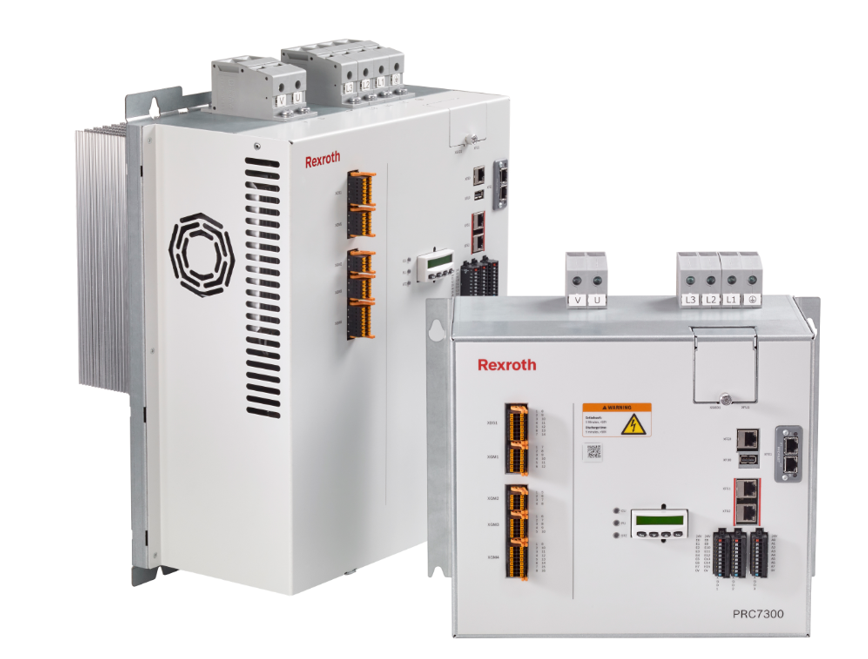

# Bosch Rexroth PRC 7000 

The PRC 7000 is the latest generation of resistance welding control systems. It delivers what you are entitled to expect 
from the European market leader: a highly efficient, reliable control system. With intuitive operation, state-of-the-art hardware and 
adaptive control – for ultra-fast commissioning, energy-saving.


## Available devices

The PRC 7000 are identified through names, printed on the of the device. 
The following devices are available:

|         Name            |          MAC        |   IP   |
|-------------------------|---------------------|--------|
|  PRC006034AEDAC4  	  |  00:60:34:AE:DA:C4  |  DHCP  |
|  PRC006034AEEF5D  	  |  00:60:34:AE:EF:5D  |  DHCP  |
|  PRC006034AEDAC2        |  00:60:34:AE:DA:C2  |  DHCP  |
|  PRC006034AEEFEC        |  00:60:34:AE:EF:EC  |  DHCP  |
|  PRC006034AEED79        |  00:60:34:AE:ED:79  |  DHCP  |
|  PRC006034ADE693        |  00:60:34:AD:E6:93  |  DHCP  |
|  PRC006034AF1C59        |  00:60:34:AF:1C:59  |  DHCP  |
|  PRC006034AF1BCB        |  00:60:34:AF:1B:CB  |  DHCP  |
|  PRC006034AF1BD5        |  00:60:34:AF:1B:D5  |  DHCP  |
|  PRC006034AF0673        |  00:60:34:AF:06:73  |  DHCP  |

You will find the IP adress over the display menu. 


## Device capabilities

On top of welding, the PRC 7000 can also:
- be programmed using C/C++, Python, Java and node-red
- send weld data to the Bosch Cloud 
- be parametrized via REST API


## Example of the weld data
```JSON
{
  "topic": "com.bosch.si.myapp/MyPRC7000-PRC1232132133123/things/twin/commands/modify",
  "path": "/features/welding/properties/status",
  "value": {
    "date": "2017-03-08 14:14:10+0000",
    "PSFlowerTolerance": 4500,
    "tipName": "Gun_1",
    "length": 412,
    "errorCode": 0,
    "PSFactualValue": 7833,
    "UIPreferenceValue": 10000,
    "UIPupperTolerance": 7000,
    "voltage": [ 1.791, 1.788, ... 1.784, 1.781, 1.777, 1.774, 1.77, 1.766, 1.763, 1.759, 1.755, 1.751, 1.747, 1.743, 1.739, 1.735],
	"gunName": "Gun_1",
    "referenceCurveLength": 370,
    "spatterTime": 0,
    "UIPlowerTolerance": 4500,
    "PSFreferenceValue": 10000,
    "current": [10.008, 9.984, ... 9.96, 9.935, 9.911, 9.887, 9.862, 9.838, 9.814, 9.79, 9.765, 9.741, 9.717, 9.692, 9.668, 9.644],
	"PSFupperTolerance": 10000,
    "weldOn": true,
    "UIPactualValue": 10966,
    "tipDressCount": 0,
    "tipWearCount": 10,
    "ernergy": 0,
    "spotName": "1_0"
  }
}
```

## Ideas for optimizing this device or the production performance
- Online optimization of the current level to achieve a lower expulsion rate and still keep an acceptable quality (quality estimation index)
- Enhanced UX with interactive dashboard
- Communication between weld controllers to alert low quality welds performed by multiple controllers in series


## Additional information

