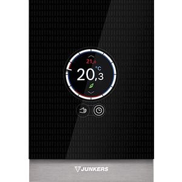

# Bosch RRC / CT100

The Remote Room Controller is a smart thermostat that allows you to control your heating system and monitor and control your heating and warm water usage.

	
## Available devices

The devices we have available at BCX include a heating simulator. They publish telemetry into Hono using a device ID  `rrc.<serialnumber>`.

The main data available are the environmental and the room temperature, as well as the temperature setpoint and current status of the heating.

## Additional information

Detailed technical specifications can be found on the [product page](https://www.junkers.com/endkunde/produkte/produktinformation/produktkatalog_61184).