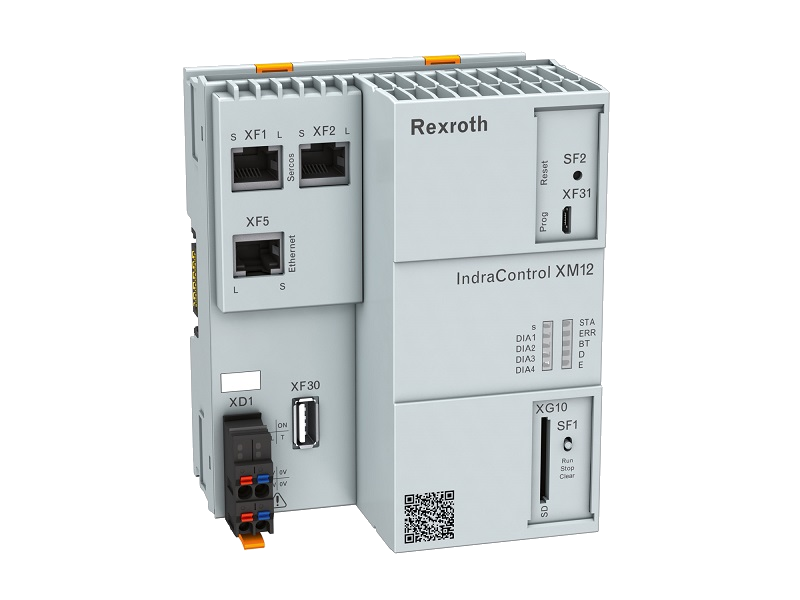

# Bosch Rexroth IoT Gateway

Network new and existing machines cost efficiently and optimize production processes and product quality: The IoT Gateway makes it easy to connect to Industry 4.0 environments without intervening in the automation logic. The precisely coordinated combination of control hardware and software for implementing IT applications collects sensor and process data, transmits it to MES, cloud applications or local machine state monitoring systems, for example, and enables process data analysis.

## Available devices

The following devices are available:

- iotgateway.test

## Device capabilities

IoT Gateway provides access to a number of sensors. The values will be transmitted as events on value change:
- ProximitySensor
- LightBarrier

## Ideas for using this device

- Use the existing sensors to track the passage of objects

## Additional information

Detailed technical specifications can be found on the [documentation page](https://brmv2.kittelberger.net/borexmvz2-internet/Category.jsp;jsessionid=59A5843B5623182423D7629EF1C83883.borex-tc?language=de-DE&publication=NET&ccat_id=80464&remindCcat=on).
