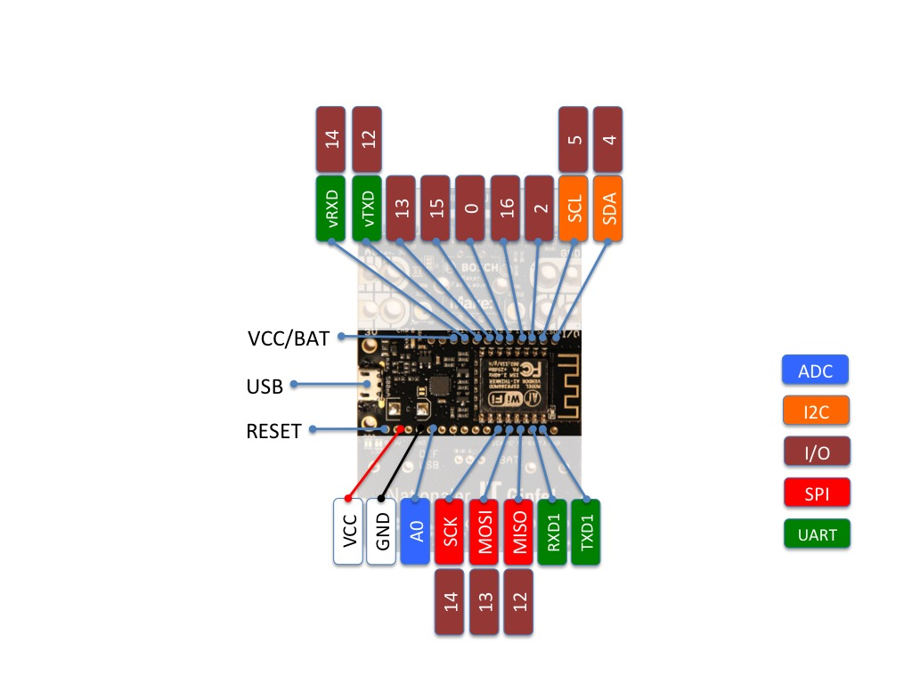

# ESP8266

The [ESP8266](http://espressif.com/en/products/hardware/esp8266ex/overview) is a SoC with a 32-bit microprocessor and WiFi chip. It can be programmed using the Arduino IDE, amongst others.

**The ESP8266 is a 3.3V chip - be careful to not accidentially connect 5V to it**

We have two different ESP8266 boards available:

- 10 NodeMCU v2 boards
- Around 30 [Octopus](http://fab-lab.eu/octopus/) boards 

The Octopus comes with the following features:

- Bosch Sensortec BME280 (Humidity, Barometer, Temperatur)
- 2 RGBW Neopixel
- 2 Grove pinout (Analog and I2C, **3V only**!)
- Adafruit-compatible Featherwing pin-out

## Installation

To configure your Arduino IDE for ESP8266 programming, follow the steps outlined [in this AdaFruit tutorial](https://learn.adafruit.com/adafruit-feather-huzzah-esp8266/using-arduino-ide).

To use the Octopus on a macOS machine, you might have to install a [USB serial driver for the CP210x](http://www.silabs.com/products/mcu/pages/usbtouartbridgevcpdrivers.aspx)

In the Arduino IDE, make sure to select these Board settings:

- Board: "Generic ESP8266 Module"
- Reset Method: "nodemcu"
- Upload Speed: "921600"
 
In the library manager, install the following modules:

 * ArduinoJson
 * ESP8266RestClient

## Pinout

The naming convention of the ESP8266 differs from the usual Arduino pin names. The Arduino Pin Definitions can be found in the [esp8266 Arduino repository](https://github.com/esp8266/Arduino/blob/master/variants/nodemcu/pins_arduino.h#L37-L59.)

The following diagra shows the NodeMCU and Octopus pinouts (courtesy of [fab-lab.eu](http://fab-lab.eu/))

| Pin number | Function                        |
|------------|---------------------------------|
| 0          | GPIO0 (Flash button on NodeMCU)
| 1          | GPIO1
] 2          | GPIO2
| 3          | GPIO3
| 4          | GPIO4 (SDA)
| 5          | GPIO5 (SCL)
| 6          | GPIO6
| 7          | GPIO7
| 8          | GPIO8
| 9          | GPIO9
| 10         | GPIO10
| 11         | GPIO11
| 12         | GPIO12
| 13         | GPIO13
| 14         | GPIO14
| 15         | GPIO15
| 16         | GPIO16 (Also used for sleep mode)
| A0         | ADC (note: disable current measurement in settings.h to use this port) |

## Connectivity

The examples provided register the ESP8266 with Hono, creating a device ID using the MAC
address (e.g. `esp8266.5ccf7f001122`). They also open a webserver on port 80 that you can use to receive commands and process them on the device.

## Examples

Check out [esp8266_simple/](esp8266_simple/) for an (actually not so simple) example that
publishes the current core voltage as telemetry data and sends events when the flash button (connected to GPIO0 on the NodeMCU) is pressed or released.
