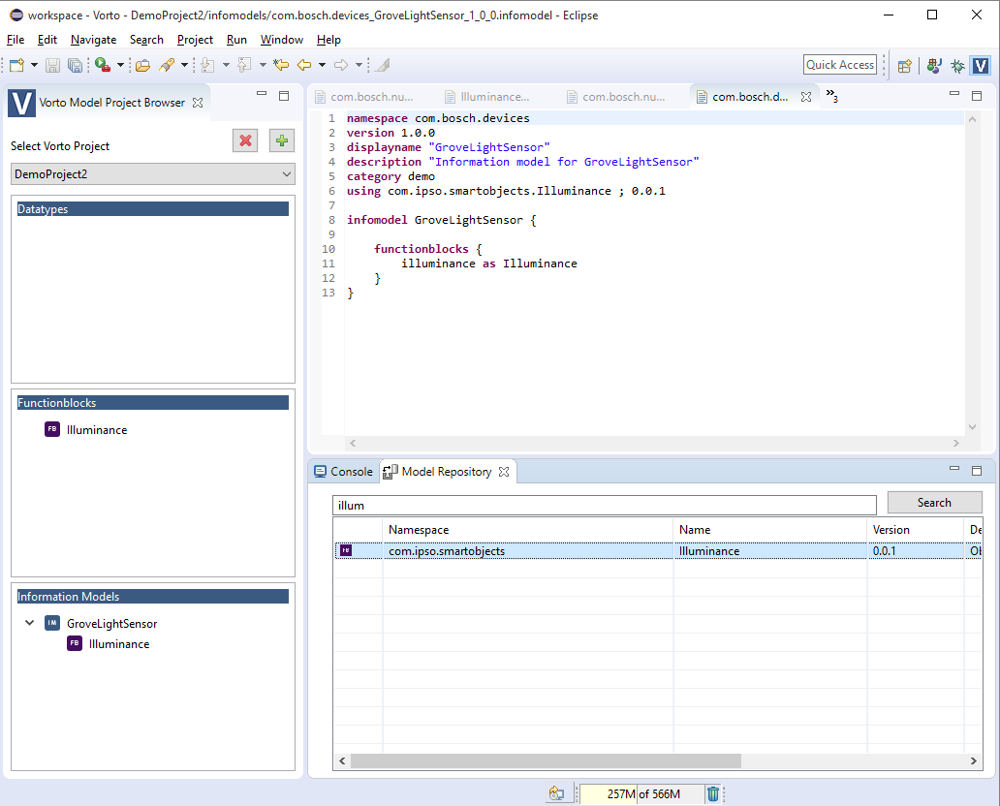

## What is a thingtype ?

A thing type basically describes the characteristics and functionality of a device. The Bosch IoT Suite understands thing type properties and uses them to bootstrap Bosch IoT Suite services. Developers can make use of Code Generators for thing types using the [Developer Console](https://console.bosch-iot-suite.com) in order to quickly build IoT applications. Thing Types are entirely based on the [Open Source Eclipse Vorto Project ](https://www.eclipse.org/vorto). 

## Create and Publish a new thingtype

**Prerequisite**

[Eclipse Neon for DSL Developers](http://www.eclipse.org/downloads/packages/eclipse-ide-java-and-dsl-developers/neon2) 

**Steps**

- Download the [Eclipse Vorto Plugins ](https://marketplace.eclipse.org/content/vorto-toolset) from your Eclipse IDE
- Restart your Eclipse
- Under Eclipse Preferences -> Vorto -> Information Model Repository, make the following changes: 
	
	URL: http://thingtype.bosch-iot-suite.com
	User: [your username]
	Password: [your password]

- Switch to the Vorto Perspective
- Create a new Vorto Project by selection the + icon
- In the _Information Model_ View on the lower left handside corner, _right-click_ and choose _New Information Model_. Enter the name of your device, e.g. GroveLightSensor and click _Finish_. 
- Browse through the list of functionblocks in the Model Repository View and _Drag n Drop_ the required functionblocks for your device onto the Information Model.

_Example_:

 
- When you finished describing your device, _right-click_ on the Information Model and choose _Share_ in order to publish it to the Model Repository 

_Example_:

 

## What's next ? 

[Register a new device](register_new.md)
