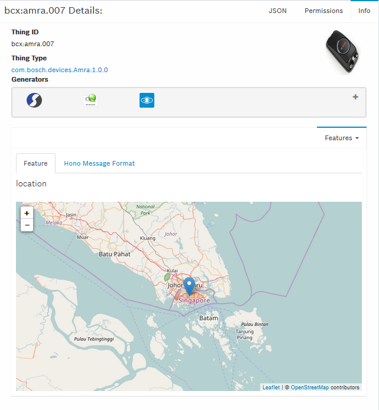

## Visualize device data

For debugging purposes while the device sends data to the Suite, the developer console can be used to track any device status updates. 

**Steps**

- Go to _Thing Browser_ and select the device for which you would like to see the data. This opens the thing details.
- You can either select the feature from the dropdown list or switch to JSON tab in the top right corner to see the entire JSON message of the device. 

_Example_:

