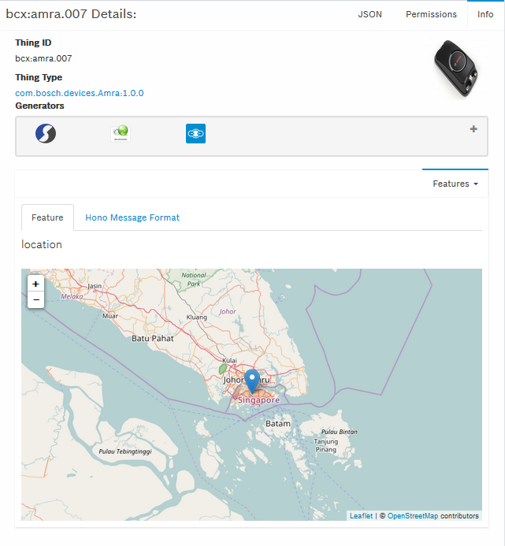

## Visualize device data

For debugging purposes and while the device sends data to the Suite, you can receive these messages in the developer console.

**Steps**

- Sign in to the [Developer Console](https://console.bosch-iot-suite.com)
- Go to _Thing Browser_ and select the device for which you would like to see the data. This opens the thing details.
- Select the feature from the dropdown list in order to see the last received device data. 

_Example_:

