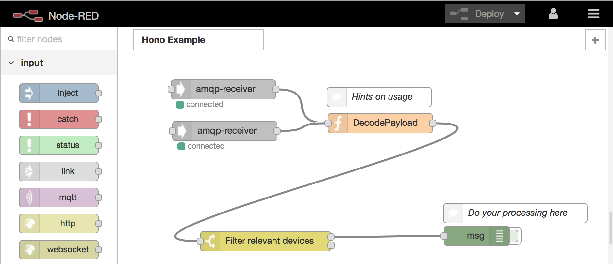

# Node-RED

The example flow `hono-receiver.json` connects to the Hono server and registers telemetry and event receivers. 



## Usage

Using this flow requires installation of the AMQP nodes provided by [node-red-contrib-rhea](https://github.com/ppatierno/node-red-contrib-rhea).
You can install these nodes into your existing Node-RED installation using

```
npm install node-red-contrib-rhea
```

or you can set up a new Node-RED instance using use the docker image [crenz/node-red-docker](https://hub.docker.com/r/crenz/node-red-docker/).
