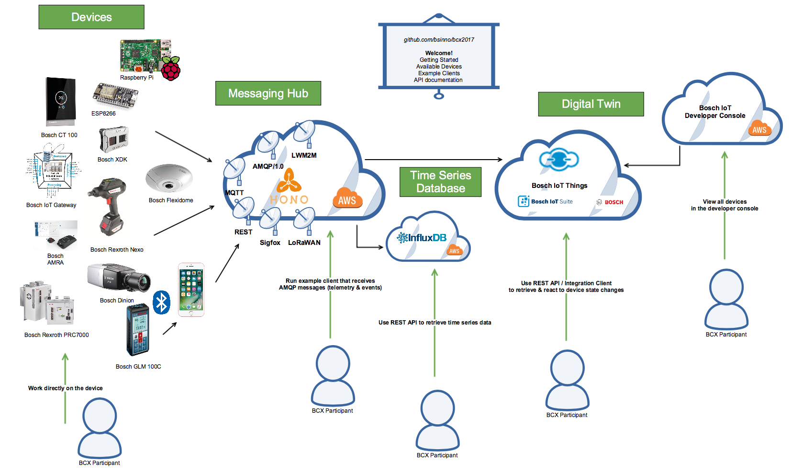

# Welcome to [Bosch Connected Experience 2017](http://bcw.bosch-si.com/berlin/bcw-hackathon/)!

In this repository, you will find all the information needed to get started with the device hub we set up for this hackathon. The device hub itself is a custom setup for this hackathon and composed of components from the [Eclipse IoT](https://iot.eclipse.org) community, services from the [Bosch IoT Suite](https://bosch-iot-suite.com) and other open source and custom components.

# Introduction

The general idea of this setup is: We want you to be able to prototype IoT ideas and solutions as quickly as possible. For that, we provide you with data from many different “Things”: A number of Bsoch devices from various domains, as well as some commonly-used prototyping boards.

All of these devices are already connected to a *Messaging Hub* based on [Eclipse Hono](https://www.eclipse.org/hono) running on the Internet. We have also tried to make sure that you can easily access the data and events produced by these devices using multiple APIs.

By the way – many of the available devices allow you to work not just with the data on the backend, but directly on the device itself.

The following diagram provides an overview of the setup.



The following sections provide you with details regarding the different ways you can access the device data and use it in your project.

# So, what kind of devices are available?

You can find information about the devices we have connected to Hono in the [Available_Devices/](Available_Devices/) directory. (There's also quite a number of sensors and other devices available in the “Gadget Library”, but these are not (yet) connected to our backend.)

# What kind of data do these devices send?

Most devices supply both telemetry data (information on the current device status: temperature, humidity, …) and events (e.g. buttons pressed, the device being moved, …). All devices supply their data as JSON data structures. In a number of cases, the device data also contains additional meta-information that allows us to display the information better in our services.

# How can I receive current device data from the messaging hub?

The connected devices publish their telemetry data and events to an [Eclipse Hono](https://www.eclipse.org/hono/) instance accessible at `hono.bosch-iot-suite.com`.

You can consume the device data by connecting an AMQP 1.0 client to Hono and listening in on the `telemetry` or `event` addresses respectively. We have prepared some example client code using various programming languages in the [Example_Clients/](Example_Clients/) directory.

Hono is actually payload-agnostic, so you will just receive the raw payload in the AMQP client in the same way as it was fed into Hono by the device.

The Eclipse Hono website has further information on the [Telemetry API](https://www.eclipse.org/hono/api/Telemetry-API/) and the [Event API](https://www.eclipse.org/hono/api/Event-API/).

# How can I look at historical device data?

All telemetry data sent in from devices is also fed into an istance of the open source [InfluxDB](https://github.com/influxdata/influxdb) *Time Series Database*. For that purpose, the JSON data structures are flattened into a list of fields (because that's what InfluxDB supports).

If you want to just quickly retrieve historical data without getting too much into InfluxDB, use these simple webservices we created for you:

List all devices with available telemetry data:
> http://bcx-workhorse.bosch-iot-suite.com/telemetry

List all devices with available event data:
> http://bcx-workhorse.bosch-iot-suite.com/events      

Get last ten telemetry data sets from device rrc.655997720 (one of our thermostats):
> http://bcx-workhorse.bosch-iot-suite.com/telemetry?deviceId=rrc.655997720&limit=10

Get last ten events from device esp8266.60019400998b
> http://bcx-workhorse.bosch-iot-suite.com/events?deviceId=esp8266.60019400998b&limit=10

Interested to know more and have more flexible options? Read on.

Telemetry is fed into the `bcx2017_telemetry` database, events are fed into the `bcx2017_events` database. Credentials for accessing the InfluxDB can be found on our passwords sheet.

In order to retrieve data, you need to write queries in the [InfluxQL query language](https://docs.influxdata.com/influxdb/v1.2/query_language/) and execute them via e.g. `curl`, the InfluxDB CLI tools, or another InfluxDB client (e.g. Node-RED InfluxDB nodes).

Here are some examples you can use as a starting point for your own experiments.

## Read out latest 10 telemetry data sets from one of the Bosch wall thermostats

> SELECT * from "rrc.655997720" ORDER BY time desc LIMIT 10

```
curl -G -u USER:PASS --data-urlencode "db=bcx2017_telemetry" http://bcx-workhorse.bosch-iot-suite.com:8086/query --data-urlencode 'q=SELECT * from "rrc.655997720" order by time desc limit 10' --data-urlencode pretty=true
```

## Read out latest entry from all XDKs

> select * from /xdk\..*/ order by time desc limit 1

```
curl -G -u USER:PASS --data-urlencode "db=bcx2017_telemetry" http://bcx-workhorse.bosch-iot-suite.com:8086/query --data-urlencode 'q=SELECT * from /xdk\..*/ order by time desc limit 10' --data-urlencode pretty=true
```

Further guidance can be found in the [Getting Started](https://docs.influxdata.com/influxdb/v1.2/introduction/getting_started/) section of the InfluxDB documentation and on the [InfluxDB API page](https://docs.influxdata.com/influxdb/v1.2/tools/api/) (see "query").

# What if I want to look at the whole device, not just messages? 

We're using the metaphor of a *Digital Twin* to express that for IoT assets, there's both a physical device, and a digital representation of its capabilities and aspects in the backend. We created a cloud service called [Bosch IoT Things](https://things.apps.bosch-iot-cloud.com/) that enables applications, cloud services, and devices to manage the data of their IoT assets in a simple, convenient, robust, and secure way. Solutions can store and update the data, properties, and relationships of your domain's assets and get notified of all relevant changes.

By the way - we proposed a new open source project called [Eclipse Ditto](https://projects.eclipse.org/proposals/eclipse-ditto) where we plan to open-source some of our digital twin technology. The proposal page has a good intro to this topic overall.

In order to work with Bosch IoT Things, you can either use a Java client, or the HTTP API. Let's look at the API:

## Getting started with the HTTP API

An IoT developer can create, read, update and delete Things via the Bosch IoT Things HTTP API. 

To use the HTTP API you will need:

 * The header for authenticating your solution: ``x-cr-api-token: {apiToken}``
 * The header for authenticating the current user via Basic Auth: ``Authorization: Basic base64({username}:{password})``

The root resource of the Bosch IoT Things HTTP API is located at ``https://things.apps.bosch-iot-cloud.com/cr/1``.
All requests and responses are ``JSON``-based so please use ``application/json`` as the ``Content-Type`` for your 
requests.

### Search things
Let's see which Things your user is allowed to see. By default this request will not return more than 25 things.

> GET /search/things

You can further filter or limit the returned results, see the 
[HTTP API documentation](https://things.apps.bosch-iot-cloud.com/documentation/rest/#) for more information.

### Retrieve a Thing
Retrieve a single Thing by its Thing ID:

> GET /things/{thingId}

You can read only parts of a Thing by specifying the path inside the Thing via the URL path e.g. to read an 
attribute ``location`` use the following path:

> GET /things/{thingId}/attributes/location

### Modify a Thing

You can either update the whole Thing at once (attention, this overwrites all data of a Thing) or only parts of it 
e.g. its attributes or a single property value. 

To update the ``location`` attribute of a Thing use the following request:
> PUT /things/{thingId}/attributes/location

Example of JSON request body:
```json
{
  "longitude": -27.119444,
  "latitude" : -109.354722
}
```
### Further operations

For a complete list of available operations please refer to the 
[HTTP API documentation](https://things.apps.bosch-iot-cloud.com/documentation/rest/#).

In case you are familiar with [Postman](https://www.getpostman.com/) we also have prepared a 
[Postman Collection](https://github.com/bsinno/iot-things-examples/tree/master/postman-collection)
for you to quickly get started (tip: use the environment ``env_CRaaS-prod-environment.json`` to have the correct 
endpoint configured automatically).

## Java API

If you prefer a Java based approach you can also use the 
[Things Integration Client](https://cr.apps.bosch-iot-cloud.com/dokuwiki/doku.php?id=005_dev_guide:005_java_api:005_java_api) 
to access your Things and to subscribe for changes that are made to your Things.
To get started go to the 
[Hello World Example](https://things.apps.bosch-iot-cloud.com/dokuwiki/doku.php?id=005_dev_guide:tutorial:000_hello_world)
of using the Java Client.

## Further information
* Main entry point for 
[Bosch IoT Things documentation](https://things.apps.bosch-iot-cloud.com/dokuwiki/doku.php?id=start)
* Complete documentation of [Things HTTP API](https://cr.apps.bosch-iot-cloud.com/documentation/rest/#)
* Documentation of the 
[Things Integration Client](https://cr.apps.bosch-iot-cloud.com/dokuwiki/doku.php?id=005_dev_guide:005_java_api:005_java_api)
* [Code examples](https://github.com/bsinno/iot-things-examples) of using the Things Integration Client (Java)

# Getting started with the Developer Console

The [Developer Console](https://console.bosch-iot-suite.com) lets you easily interact with the Bosch IoT Suite services in order to connect a device and build IoT applications. Click on the sub-topics to find out more: 

* [Register a new device](Documentation/DevConsole/register_new.md)
* [Send device payload to Bosch IoT Things via Hono](Documentation/DevConsole/send_telemetry_data.md)
* [Visualize device payload](Documentation/DevConsole/visualize_data.md)
* [Describe a device with thing types](Documentation/DevConsole/create_thingtype.md)

# What else do I need to get started?

A cup of coffee. A good idea. And a great team to work with.

If you need any help, we have a team of hack coaches available to help you. You'll find information on who to refer to for each topic on the tables at the hackathon site. If you want to connect one of your own devices to this backend, please approach one of the hack coaches.
